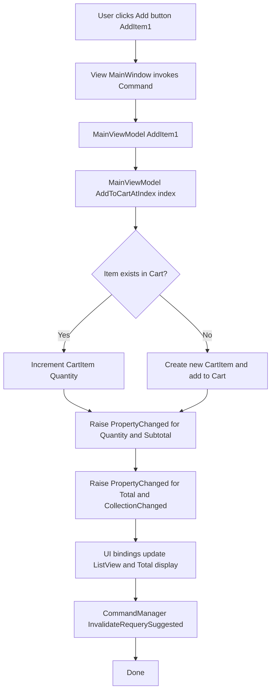
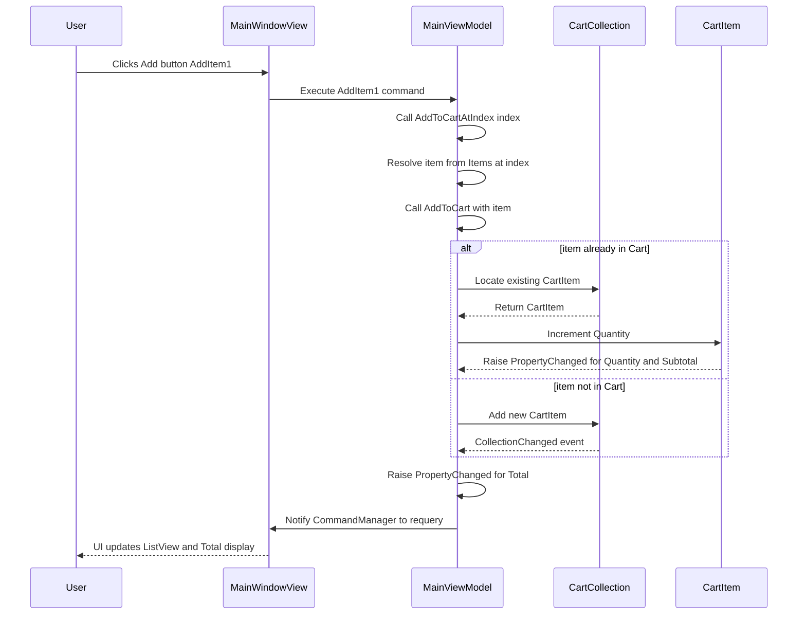

# cash-register
 This applicaiton is created with C# and allows for adding items and creating transactions.

```mermaid
flowchart TD
  A[User clicks Add button AddItem1] --> B[View MainWindow invokes Command]
  B --> C[MainViewModel AddItem1]
  C --> D[MainViewModel AddToCartAtIndex index]
  D --> E{Item exists in Cart?}
  E -- Yes --> F[Increment CartItem Quantity]
  E -- No  --> G[Create new CartItem and add to Cart]
  F --> H[Raise PropertyChanged for Quantity and Subtotal]
  G --> H
  H --> I[Raise PropertyChanged for Total and CollectionChanged]
  I --> J[UI bindings update ListView and Total display]
  J --> K[CommandManager InvalidateRequerySuggested]
  K --> L[Done]
```

```mermaid
  sequenceDiagram
  participant User
  participant View as MainWindowView
  participant VM as MainViewModel
  participant Cart as CartCollection
  participant CI as CartItem

  User->>View: Clicks Add button AddItem1
  View->>VM: Execute AddItem1 command
  VM->>VM: Call AddToCartAtIndex index
  VM->>VM: Resolve item from Items at index
  VM->>VM: Call AddToCart with item
  alt item already in Cart
    VM->>Cart: Locate existing CartItem
    Cart-->>VM: Return CartItem
    VM->>CI: Increment Quantity
    CI-->>VM: Raise PropertyChanged for Quantity and Subtotal
  else item not in Cart
    VM->>Cart: Add new CartItem
    Cart-->>VM: CollectionChanged event
  end
  VM->>VM: Raise PropertyChanged for Total
  VM->>View: Notify CommandManager to requery

  View-->>User: UI updates ListView and Total display
```
Something

